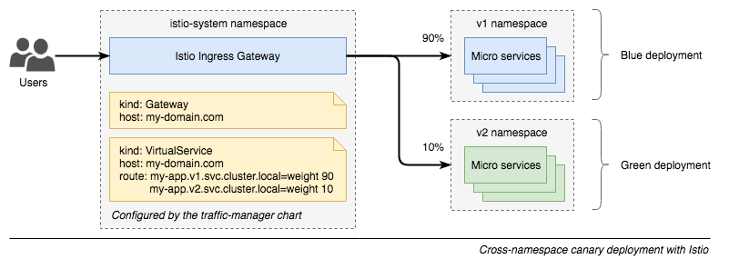

Cross-namespace canary release using Kubernetes, Istio and Helm
===============================================================

> Demo of a cross-namespace canary release using Istio service mesh with
mutual TLS enabled and Helm charts. It makes use of the new
[Istio v1alpha3 routing API](https://preliminary.istio.io/blog/2018/v1alpha3-routing.html).



## Overview

```
.
├── Makefile
├── istio.yaml                      // Istio chart configuration
├── nginx                           // nginx is used as an example of microservice
│   ├── Dockerfile
│   ├── charts
│   │   ├── templates
│   │   │   ├── _helpers.tpl
│   │   │   ├── deployment.yaml
│   │   │   └── service.yaml
│   │   ├── Chart.yaml
│   │   └── values.yaml
│   └── default.conf
├── services                        // all microservices should be defined in this directory as subchart
│   ├── Chart.yaml
│   ├── requirements.yaml
│   └── values.yaml
└── traffic-manager                 // chart with all the Istio configuration.
    ├── templates
    │   ├── _helpers.tpl
    │   ├── gateway.yaml            // ingress configuration
    │   └── virtualservice.yaml     // routing
    ├── Chart.yaml
    └── values.yaml
```

## Getting started

### Requirements

- [Docker](http://docker.io/)
- [Minikube](https://github.com/kubernetes/minikube)
- [Helm](https://helm.sh)

### Play yourself

```
# start Minikube with necessary flags to get started with Istio mTLS and automatic sidecar injection
$ minikube start --kubernetes-version=v1.10.0 --memory 8192 --cpus 2

# install Tiller
$ kubectl apply -f ./tiller-rbac.yaml
$ helm init --service-account tiller --upgrade --wait

# install Istio with mTLS
$ make deployistio

# update Helm subcharts
$ cd services && helm dep update --skip-refresh && cd ../

# build nginx container which contains curl
# if using Istio with mTLS, we need to use curl to run the probe
# ref: https://github.com/istio/istio/issues/1194
$ make buildnginx

#
# Deploy services v1
#

# create namespace and enable automatic sidecar injection
$ kubectl create ns services-v1
$ kubectl label ns services-v1 istio-injection=enabled

$ helm upgrade -i services-v1 --namespace=services-v1 ./services

# deploy Istio routing via traffic manager
$ helm upgrade -i traffic-manager ./traffic-manager


# To test if the release was successful:
$ ingress_gateway=$(minikube service istio-ingressgateway -n istio-system --url | head -n1)
$ curl $ingress_gateway -H 'Host: search.local'
Host: search-77f9697d44-l8dtc


#
# Deploy services v2
#

$ kubectl create ns services-v2
$ kubectl label ns services-v2 istio-injection=enabled
$ helm upgrade -i services-v2 --namespace=services-v2 ./services


#
# Canary
#

# shift 10% of the traffic to services-v2
$ helm upgrade traffic-manager --set canary.enabled=true ./traffic-manager

$ ingress_gateway=$(minikube service istio-ingressgateway -n istio-system --url | head -n1)
$ while sleep 0.1; do curl $ingress_gateway -v -H 'Host: search.local'; done
Host: search-77f9697d44-l8dtc
Host: search-77f9697d44-l8dtc
Host: search-77f9697d44-l8dtc
Host: search-77f9697d44-l8dtc
Host: search-77f9697d44-l8dtc
Host: search-77f9697d44-l8dtc
Host: search-6b8cc5d6f7-pzwcb
Host: search-77f9697d44-l8dtc
Host: search-77f9697d44-l8dtc


#
# Full rollout
#

# when we are ready, shift 100%
$ helm upgrade traffic-manager \
    --reset-values \
    --set stable.serviceName=search.services-v2.svc.cluster.local \
    ./traffic-manager


#
# Rollback
#

# shift 100% traffic back to services-v1
$ helm upgrade traffic-manager \
    --reset-values \
    ./traffic-manager


#
# Cleanup
#
$ helm del --purge services-v1
```


### Access release based on Headers

If you want to run end-to-end tests against a new release in a "production"
environment, you can configure Istio to match traffic based on HTTP Headers.

You can enable it in the traffic-manager values.yaml file. Then redeploy:

```
$ helm upgrade -i traffic-manager \
    --set canary.enabled=true \
    ./traffic-manager
$ ingress_gateway=$(minikube service istio-ingressgateway -n istio-system --url | head -n1)
$ curl $ingress_gateway -v -H 'Host: proxy.local' -H 'X-Track: canary'
```
